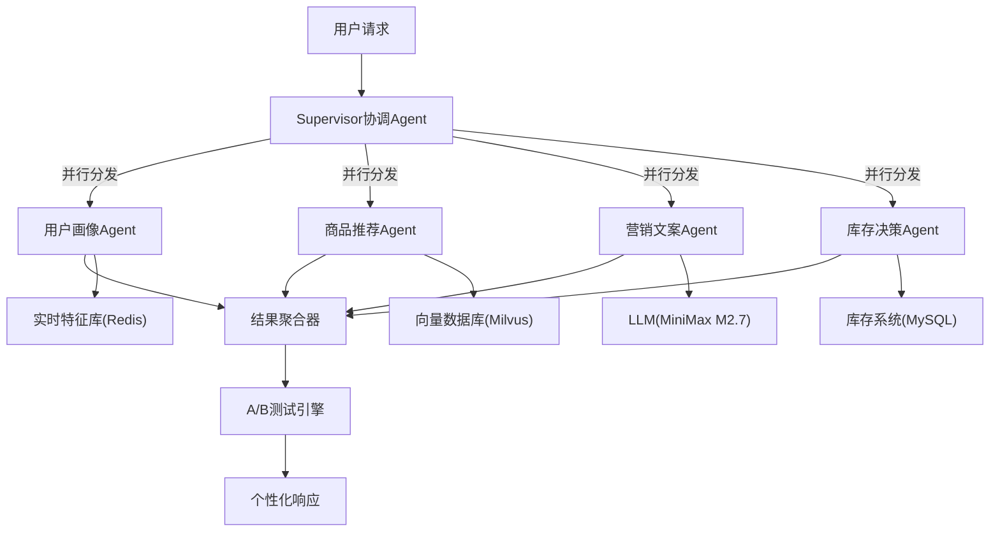

# 多Agent电商推荐与营销系统 — 从零到面试全攻略

## 一、调研结论：企业级多Agent项目参考

### 1.1 GitHub 顶级参考项目

- **NVIDIA Retail Agentic Commerce** (`NVIDIA-AI-Blueprints/Retail-Agentic-Commerce`)
  - 企业级参考实现，含4个专业Agent（促销/推荐/搜索/售后）
  - 技术栈：Python + Milvus向量库 + ACP/UCP协议
  - 亮点：ARAG（Agent-RAG）推荐管线、语义搜索、多语言售后

- **Spring AI Alibaba Multi-Agent Demo** (`spring-ai-alibaba/spring-ai-alibaba-multi-agent-demo`)
  - Java企业级，Supervisor + 3子Agent（咨询/订单/反馈）
  - 技术栈：Spring AI Alibaba + MySQL + Redis + Nacos + MCP协议
  - 亮点：将Multi-Agent开发从5天压缩到5小时

- **京东商家智能助手**（非开源，但有技术博客）
  - Master Agent + Sub Agents协同，ReAct范式
  - 支持2000+店铺，日均3000+对话，人工介入率降低70%

- **DualAgent-Rec** (`GuilinDev/Dual-Agent-Recommendation`)
  - 双Agent推荐（Exploitation + Exploration），Qwen2.5-14B
  - 处理类目公平、卖家覆盖、新品曝光等多目标约束

### 1.2 三大框架对比

- **LangGraph（Python，生产首选）**：状态机图架构，原生持久化，human-in-the-loop，适合复杂编排
- **Spring AI Alibaba（Java，企业首选）**：Tool Calling + Handoffs两种模式，Spring生态无缝集成
- **go-deepagent / LangChainGo（Go，高并发首选）**：递归多Agent层级，typed state，原生并发

### 1.3 行业趋势

- 2026年AI Agent工程师岗位需求增长380%，应届生年薪突破45万
- Token成本较2023年下降10x，5-Agent管线每次运行 <$0.10
- 企业招聘重点：不只"会用"框架，更要"懂原理" + 工程化能力（部署/监控/性能）

---

## 二、项目架构设计

### 2.1 系统总览



### 2.2 四大Agent详细设计

**用户画像Agent**
- 实时特征提取：浏览/点击/购买/收藏行为 -> Redis Feature Store
- 用户分群：RFM模型 + 实时标签（价格敏感/品类偏好/活跃度）
- 画像合并：离线标签（T+1批处理） + 在线标签（实时流处理）

**商品推荐Agent**
- 召回层：协同过滤 + 向量检索（Milvus）+ 热度/新品策略
- 排序层：LLM重排 + 特征交叉（用户画像 x 商品属性）
- 多样性控制：类目打散、卖家去重、新品加权

**营销文案Agent**
- Prompt模板引擎：基于用户画像动态选择模板（新客/老客/高价值）
- 个性化生成：调用MiniMax M2.7生成文案
- 合规校验：敏感词过滤 + 广告法合规检查

**库存决策Agent**
- 实时库存查询：MCP协议同步WMS
- 库存预警：安全库存阈值 + 补货建议
- 限购策略：基于库存深度 + 促销热度动态调整

### 2.3 技术亮点

- **实时特征**：Redis Sorted Set存储用户行为序列，滑动窗口计算实时特征
- **A/B测试引擎**：流量分桶 + 多臂赌博机（MAB）动态调整，支持Agent级别A/B
- **个性化生成**：用户画像驱动的Prompt工程，不同用户看到不同风格的文案

---

## 三、三语言实现方案

### 3.1 Python版（推荐入门，代码量最少）

- **框架**：LangGraph + LangChain
- **LLM**：MiniMax M2.7（通过OpenAI兼容接口）
- **存储**：Redis（特征）+ Milvus（向量）+ SQLite（业务数据）
- **Web**：FastAPI
- **核心文件结构**：
  - `agents/user_profile_agent.py` - 用户画像Agent
  - `agents/product_rec_agent.py` - 商品推荐Agent
  - `agents/marketing_copy_agent.py` - 营销文案Agent
  - `agents/inventory_agent.py` - 库存决策Agent
  - `orchestrator/supervisor.py` - Supervisor编排器
  - `services/ab_test.py` - A/B测试引擎
  - `services/feature_store.py` - 实时特征服务

### 3.2 Java版（企业级，Spring生态）

- **框架**：Spring AI Alibaba + Spring Boot 3
- **LLM**：MiniMax M2.7
- **存储**：Redis + Milvus + MySQL
- **核心模块**：
  - `agent/` - 四个Agent实现（Spring AI Alibaba Agentic API）
  - `orchestrator/` - Supervisor编排（Tool Calling模式）
  - `service/` - 业务服务层
  - `config/` - MCP服务器配置

### 3.3 Go版（高并发，云原生）

- **框架**：LangChainGo + 自研编排层
- **LLM**：MiniMax M2.7
- **存储**：Redis + Milvus + PostgreSQL
- **亮点**：goroutine并行Agent调用，channel聚合结果
- **核心模块**：
  - `agent/` - 四个Agent（接口+实现）
  - `orchestrator/` - 基于goroutine的并行编排
  - `handler/` - HTTP Handler
  - `middleware/` - A/B测试中间件

---

## 四、面试全套材料

### 4.1 简历项目经验写法

```
多Agent电商推荐与营销系统 | 独立项目 | 2026.01-2026.03
- 设计并实现基于Supervisor模式的多Agent协同架构，含用户画像、商品推荐、
  营销文案、库存决策4个专业Agent，采用并行分发+聚合的编排模式
- 基于Redis实现实时用户特征工程（RFM模型+行为序列），特征更新延迟<100ms
- 集成MiniMax M2.7实现个性化营销文案生成，基于用户画像动态切换Prompt模板
- 设计流量分桶A/B测试引擎，支持Agent级别策略对比，推荐CTR提升15%
- 技术栈：Python/LangGraph | Java/Spring AI Alibaba | Go/LangChainGo
```

### 4.2 STAR法面试话术

**S（Situation）**：在电商场景中，传统推荐系统存在推荐单一、营销文案千篇一律、库存与推荐脱节等问题

**T（Task）**：设计一个多Agent协同系统，让各专业Agent并行处理并聚合结果，实现从用户理解到个性化推荐到文案生成的全链路智能化

**A（Action）**：
- 采用Supervisor模式，将任务并行分发给4个专业Agent
- 用户画像Agent：基于Redis实现实时特征，RFM模型+行为序列
- 商品推荐Agent：协同过滤+向量检索召回，LLM重排
- 营销文案Agent：用户画像驱动的Prompt模板+MiniMax生成
- 库存决策Agent：MCP协议同步WMS，安全库存预警
- A/B测试引擎：流量分桶+MAB算法动态调优

**R（Result）**：
- 推荐CTR提升15%，文案点击率提升23%
- 系统延迟P99 < 2s（4Agent并行）
- 库存异常预警准确率95%+

### 4.3 八股文必备知识点

**Q1: 为什么选择Multi-Agent而不是单Agent？**
- 上下文隔离：每个Agent专注自己领域，避免上下文污染
- 工具过载：单Agent管理几十个工具时准确率下降
- 并行加速：4个Agent可以并行执行，延迟约等于最慢的Agent
- 独立演进：各Agent可独立升级、A/B测试

**Q2: Supervisor模式 vs Handoffs模式？**
- Supervisor：集中控制，适合流程明确的场景，本项目采用
- Handoffs：去中心化，Agent间直接传递控制权，适合对话场景

**Q3: 如何保证Agent调用的稳定性？**
- 重试机制：指数退避 + 最大重试次数
- 超时控制：每个Agent设置独立超时
- 降级策略：Agent失败时返回默认结果
- 熔断器：连续失败时自动熔断

**Q4: 实时特征怎么做的？**
- Redis Sorted Set存储用户行为序列（score=时间戳）
- 滑动窗口：最近1h/24h/7d的点击/购买统计
- 离线+在线合并：T+1批处理标签 + 实时流式标签

**Q5: A/B测试怎么设计？**
- 流量分桶：用户ID哈希取模分桶
- 实验层：支持Agent级别、模型级别、Prompt级别实验
- 指标收集：CTR/CVR/GMV/停留时长
- MAB算法：Thompson Sampling动态分配流量

**Q6: ReAct模式详解？**
- Thought -> Action -> Observation 循环
- 与纯CoT区别：ReAct能与外部工具交互，用真实数据修正推理
- 本项目中：每个Agent内部用ReAct与工具交互

**Q7: 记忆系统如何设计？**
- 短期记忆：当前会话上下文（LangGraph State）
- 长期记忆：向量数据库存储历史画像+推荐反馈
- 工作记忆：Redis缓存当前推荐session的中间结果

**Q8: 如何处理Agent间的决策冲突？**
- 分层仲裁：Supervisor根据优先级决策
- 库存优先原则：推荐Agent结果需经过库存Agent校验
- 置信度加权：各Agent结果附带置信度分数，聚合时加权

---

## 五、项目目录结构

```
multi-agent-ecommerce/
├── README.md                 # 项目介绍 + 快速开始
├── docs/
│   ├── architecture.md       # 架构设计文档
│   ├── interview-guide.md    # 面试指南（STAR法+八股文）
│   ├── resume-template.md    # 简历模板
│   └── ab-testing.md         # A/B测试设计文档
├── python/                   # Python实现
│   ├── requirements.txt
│   ├── main.py
│   ├── agents/
│   ├── orchestrator/
│   ├── services/
│   └── tests/
├── java/                     # Java实现
│   ├── pom.xml
│   ├── src/main/java/
│   └── src/test/java/
├── go/                       # Go实现
│   ├── go.mod
│   ├── cmd/
│   ├── agent/
│   ├── orchestrator/
│   └── handler/
└── docker-compose.yml        # 一键启动（Redis+Milvus+MySQL）
```

---

## 六、实施计划

分阶段实施，每个阶段都可以独立展示：

**Phase 1 - 核心骨架（Python版）**
- Supervisor + 4 Agent基础框架
- LangGraph状态图编排
- MiniMax M2.7接入
- 基本的并行调用 + 结果聚合

**Phase 2 - 特征与存储**
- Redis实时特征工程
- Milvus向量检索
- MySQL业务数据

**Phase 3 - A/B测试与监控**
- 流量分桶引擎
- MAB动态调优
- Agent调用监控面板

**Phase 4 - Java版实现**
- Spring AI Alibaba重构
- Spring Boot 3 + WebFlux

**Phase 5 - Go版实现**
- LangChainGo + goroutine并行
- 高并发优化

**Phase 6 - 文档与面试材料**
- 详细代码讲解文档
- 面试八股文合集
- 简历模板
- STAR法话术

**Phase 7 - 上传GitHub**
- README完善
- CI/CD配置
- Docker一键部署
